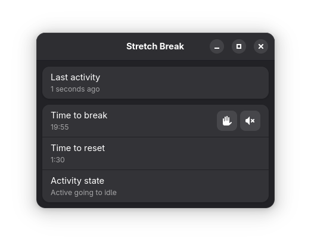
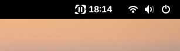

# Stretch Break

Stretch Break is a digital wellbeing tool that helps you take regular breaks. It is similar to Workrave and SafeEyes.

The application was written with GNOME and Linux in mind, but the code is mostly cross-platform. It is accompanied by a GNOME Shell extension that counts down to your next break.

