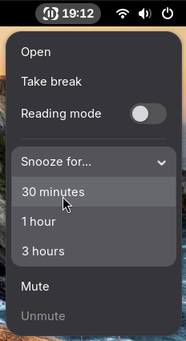

# Stretch Break

Stretch Break is a digital wellbeing tool that helps you take regular breaks. It is similar to Workrave and SafeEyes.

The application was written with GNOME and Linux in mind, but the code is mostly cross-platform. It is accompanied by a GNOME Shell extension that counts down to your next break.

     
    

## Install

### Packaged install
See [here](https://github.com/pieterdd/StretchBreak/releases) for officially available package formats. Did you package Stretch Break for your favorite Linux distro? Let us know!

### Manual install
1. Run `cargo build --release`. You may need to install additional system-level build dependencies (see [Dockerfile](Dockerfile) for reference).
2. For the GNOME Shell extension:
    - Copy the files in [src/gnome-extension](src/gnome-extension) to `~/.local/share/gnome-shell/extensions/stretch-break-companion@pieterdd.github.io`.
    - Install the [DBus service](meta/io.github.pieterdd.StretchBreak.Core.service) to ensure the Stretch Break backend can start automatically when the extension loads.
    - In the service definition, adjust the path to the binary if needed. The extension should show up next time you log in.
