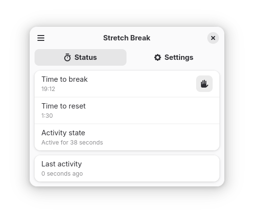

# Stretch Break


Stretch Break is a digital wellbeing tool that helps you take regular breaks. It is similar to Workrave and SafeEyes.

The application was written with GNOME and Linux in mind, but the code is mostly cross-platform. It is accompanied by a GNOME Shell extension that counts down to your next break.

<p align="center">
    <br>
    
</p>


## Install

Get the app on Flathub [here](https://flathub.org/apps/io.github.pieterdd.StretchBreak). GNOME users may want to install the [companion extension](https://extensions.gnome.org/extension/8231/stretch-break-companion/) that displays break status and provides settings access from a context menu.

For a manual install, run `cargo build --release`. You may need to install additional system-level build dependencies (see [Dockerfile](Dockerfile) for reference).


## Terminal API and third-party integrations

It is possible to control Stretch Break from the terminal:

```
$ flatpak run io.github.pieterdd.StretchBreak -h
Usage: stretch-break [OPTIONS] [COMMAND]

Commands:
  snooze-for        Stop prompting for breaks for the specified amount of minutes.
  unmute            Show break prompts until further notice.
  mute              Stop prompting for breaks until further notice.
  break             Start a break right now.
  set-reading-mode  When reading mode is active, timer won't reset during idle activity.
  widget-api        Status data for desktop widgets that source data from terminal commands.
  help              Print this message or the help of the given subcommand(s)

Options:
      --hide  Background mode: don't show the GUI.
  -h, --help  Print help
```

Use the widget API to get quick access to the status indicator data that's used within the GNOME Shell extension. This can help integrate Stretch Break with KDE, Cinnamon, i3, Sway, Niri or other desktop environments. If you made a custom integration, feel free to tell me about it via the Issues tab!


## AI policy

- Stretch Break does not accept vibecoded contributions.
- Stretch Break is open to some level of AI assistance in contributions, provided that:
  * The author discloses which AI tooling they used
  * The author is able to explain what their code does
  * There are no quality issues with the code
  * The author assumes the same responsibility over AI-written parts as human-written parts
  * The author's contribution does not infringe on anyone else's intellectual property rights
